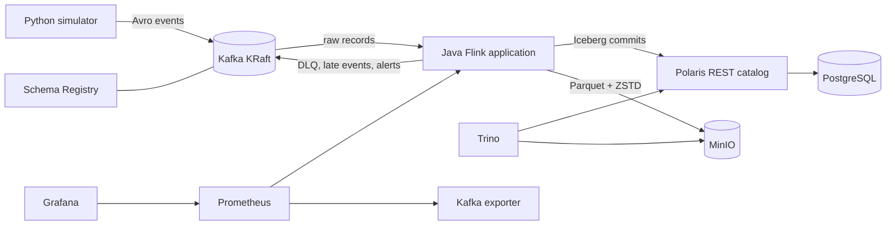

# Real-Time Cold-Chain Sensor Data Lakehouse

[](https://github.com/saadabdullah-15/real-time-cold-chain-lakehouse/actions/workflows/unit.yml)

A reproducible streaming lakehouse for refrigerated-shipment telemetry. The project generates
temperature, humidity, battery, GPS, door, and shock events; processes them with event-time
semantics; and stores auditable bronze, enriched silver, and aggregated gold data in Apache
Iceberg.

The entire platform runs locally with Docker Compose. Java and Maven builds, Python dependencies,
catalog setup, schemas, topics, dashboards, tests, and verification are all containerized.

## Architecture



The simulator uses `device_id` as the Kafka key and event time as Kafka `CreateTime`. Flink
preserves every source record before decoding, then applies validation, deduplication, temporal
metadata enrichment, late-event handling, breach detection, and hourly aggregation. Trino reads
the same Iceberg catalog and object store used by Flink.

See [the detailed architecture](docs/architecture.md) for the operator flow and delivery
semantics.

## Core behavior

- Captures exact Kafka payloads and coordinates—topic, partition, offset, timestamp, key, schema
  ID, and bytes—even when decoding fails.
- Decodes Confluent-framed Avro defensively so malformed records are quarantined without causing a
  Flink restart loop.
- Validates identifiers, coordinates, units, measurement ranges, sequence numbers, and metadata
  versions.
- Deduplicates by `event_id` with keyed state and a 24-hour TTL.
- Uses a 60-second bounded-out-of-order watermark and 30-second idle-partition detection.
- Selects the metadata version whose `effective_from` is the latest value not after the event
  timestamp.
- Routes records more than five minutes behind the active watermark to the late topic and rejected
  table.
- Applies shipment-specific temperature thresholds and emits breach alerts.
- Produces updateable hourly shipment metrics using event-time windows.
- Persists incremental RocksDB state to MinIO with 60-second checkpoints, one concurrent
  checkpoint, a two-minute timeout, retained externalized state, and fixed-delay recovery.
- Commits each Iceberg sink exactly once at successful Flink checkpoints.

Iceberg commits across different tables are independent. A checkpoint does not create one atomic
transaction spanning the complete bronze, silver, and gold model, so readers may briefly observe
checkpoint-scale visibility skew.

## Kafka contracts

All valid records contain `event_id`, `device_id`, `event_time`, `produced_at`, and
`sequence_number`.

| Topic | Partitions | Policy | Purpose |
|---|---:|---|---|
| `coldchain.telemetry.v1` | 6 | Delete, 7 days | Temperature, humidity, and battery measurements |
| `coldchain.location.v1` | 3 | Delete, 7 days | GPS position, speed, and accuracy |
| `coldchain.detection.v1` | 3 | Delete, 7 days | Door-open, door-close, and shock detections |
| `coldchain.device-metadata.v1` | 3 | Compact | Effective-dated shipment and device metadata |
| `coldchain.dlq.v1` | 3 | Delete, 30 days | Avro decoding and logical-validation failures |
| `coldchain.late.v1` | 3 | Delete, 30 days | Records rejected by the event-time lateness policy |
| `coldchain.breach-alerts.v1` | 3 | Delete, 30 days | Shipment temperature-threshold alerts |

Schema Registry uses `FULL_TRANSITIVE` compatibility. The repository includes an additive
telemetry v2 schema with nullable `signal_strength_dbm` for the documented evolution workflow.

## Lakehouse model

All tables use Iceberg format v2 with Parquet files and ZSTD compression.

| Layer and table | Write model | Partitioning | Purpose |
|---|---|---|---|
| `bronze.raw_events` | Append | Kafka day | Exact source bytes and Kafka coordinates |
| `silver.device_metadata_history` | Upsert by device/version | Unpartitioned | Effective-dated shipment metadata |
| `silver.enriched_events` | Upsert by event/day | Event day | Valid, unique, historically enriched events |
| `silver.rejected_events` | Append | Rejection day | Invalid, missing-metadata, and too-late records |
| `gold.shipment_hourly_metrics` | Upsert by shipment/window/day | Window day | Conditions, detections, breaches, locations, and counts |

The v2 evolution adds `bucket(device_id, 8)` to `silver.enriched_events` without rewriting the
files written under the original day-only partition specification.

## Prerequisites

- Docker Desktop with Docker Compose v2
- At least 4 CPUs and 10 GB of memory assigned to Docker
- PowerShell 7, available as `pwsh`

No local Python, Java, Maven, or Make installation is required. All externally exposed ports bind
to `127.0.0.1`. On first use, the operator script creates an ignored `.env` and replaces the
template passwords with generated local-development credentials.

## Quick start

```powershell
git clone https://github.com/saadabdullah-15/real-time-cold-chain-lakehouse.git
cd real-time-cold-chain-lakehouse
pwsh ./scripts/coldchain.ps1 demo
```

The `demo` command:

1. Builds and starts the complete platform.
2. Idempotently creates MinIO buckets, Kafka topics, Avro subjects, and the Polaris catalog.
3. Emits 100,000 deterministic sensor events at 500 events/second, plus device metadata and
   injected duplicate deliveries.
4. Writes `data/manifest.json` with independently generated expected counts.
5. Waits for a Flink checkpoint triggered after the simulator run.
6. Reconciles the manifest against the committed Iceberg tables through Trino.

The first run is slower because it downloads the runtime images and Maven dependencies and builds
the pinned MinIO community release from source. Later runs reuse Docker and Maven caches.

## Operations

```powershell
pwsh ./scripts/coldchain.ps1 <command>
```

| Command | Behavior |
|---|---|
| `up` | Build and start the platform, then wait for Flink and Trino |
| `status` | Show container status and local service URLs |
| `demo` | Run the default 100k-event workload and reconcile every layer |
| `verify` | Re-run reconciliation against `data/manifest.json` |
| `failure-drill` | Run the benchmark profile, kill the TaskManager, recover, and reconcile |
| `test` | Run Python tests and the Maven test suite in containers |
| `down` | Stop services while retaining volumes and generated data |
| `reset` | Delete project volumes and manifests after typing `RESET` |

`reset` is destructive. Use `-Force` only in automation where deleting all local project data is
intentional.

## Local endpoints

| Service | Address |
|---|---|
| Kafka broker | `127.0.0.1:9092` |
| Flink dashboard | http://127.0.0.1:8081 |
| Trino | http://127.0.0.1:8080 |
| Schema Registry | http://127.0.0.1:8085 |
| Polaris REST catalog | http://127.0.0.1:8181 |
| MinIO API | http://127.0.0.1:9000 |
| MinIO console | http://127.0.0.1:9001 |
| Prometheus | http://127.0.0.1:9090 |
| Grafana | http://127.0.0.1:3000 |

Use the generated values in `.env` to sign in to MinIO and Grafana.

## Querying with Trino

Run the included verification and analytical queries with the containerized Trino CLI:

```powershell
docker compose --env-file .env exec -T trino trino --file /sql/verification.sql
docker compose --env-file .env exec -T trino trino --file /sql/analytics.sql
```

The analytics cover temperature exposure, GPS gaps, rejection rates, and current shipment state.
Snapshot inspection, time travel, compaction, and guarded expiration examples are in
[`sql/maintenance.sql`](sql/maintenance.sql).

## Simulator profiles and fault injection

| Profile | Simulated workload | Default emission rate |
|---|---:|---:|
| `baseline` | 100k events across one simulated day | About 1.16 events/s |
| `demo` | 100k events across one simulated day | 500 events/s |
| `benchmark` | 300k events across five simulated minutes | 1,000 events/s |

Default fault rates are 1% duplicates, 0.5% invalid records, 5% out-of-order records, and 1%
records delayed by more than five minutes. Because metadata and duplicate deliveries are additional
Kafka records, the total raw count is greater than the configured sensor-event count.

Run a custom workload with the Compose tools profile:

```powershell
docker compose --env-file .env --profile tools run --rm simulator `
  --profile demo `
  --events 10000 `
  --rate 500 `
  --devices 100 `
  --seed 7 `
  --manifest data/custom-manifest.json
```

The CLI also accepts `--event-time-span-seconds`, `--duplicate-rate`, `--invalid-rate`,
`--out-of-order-rate`, `--too-late-rate`, and `--schema-version`.

## Verification and testing

The manifest-based verifier checks more than table availability. It asserts:

- exact raw-row reconciliation;
- uniqueness of `(topic, partition, offset)` in bronze;
- metadata-history and invalid-record reconciliation;
- uniqueness of enriched `event_id` values;
- nonzero and bounded late-event quarantine when late injection is enabled;
- valid enriched-row bounds; and
- populated gold aggregates.

Run all fast tests with:

```powershell
pwsh ./scripts/coldchain.ps1 test
```

GitHub Actions runs Python unit/contract tests, Ruff, Java tests, and Compose model validation on
pushes and pull requests. A manually triggered reduced-scale workflow starts the Docker stack,
emits 10,000 events, reconciles the results, and uploads the manifest and logs.

Configured input rate is not benchmark evidence. Record the machine, Docker allocation, Kafka lag,
checkpoint results, and reconciliation output before treating a rate as measured capacity. The
evidence checklist is in [the benchmark guide](docs/benchmark.md).

## Schema, partition, and snapshot evolution

The initial deployment uses telemetry schema v1. The controlled v2 workflow:

1. Verifies and registers the compatible Avro schema.
2. Stops the Flink job with a savepoint in MinIO.
3. Enables `PIPELINE_SCHEMA_VERSION=2` and restores from that savepoint.
4. Adds nullable `signal_strength_dbm` to the Iceberg model.
5. Evolves enriched-event partitioning to include `bucket(device_id, 8)`.
6. Demonstrates snapshot queries, time travel, compaction, and guarded snapshot expiration.

Follow [the evolution guide](docs/evolution.md) for the exact commands and safety boundary.

## Technology versions

| Component | Version |
|---|---|
| Python | 3.11 |
| Java | 17 |
| Kafka | 4.2.1 |
| Schema Registry | 8.2.2 |
| Flink | 2.1.3 |
| Flink Kafka connector | 5.0.0-2.1 |
| Iceberg | 1.11.0 |
| Polaris | 1.6.0 |
| Trino | 483 |
| PostgreSQL | 17.6 |
| Prometheus | 3.13.1 |
| Grafana OSS | 13.0.3 |
| MinIO | `RELEASE.2025-10-15T17-29-55Z`, built from source |

## Repository structure

| Path | Purpose |
|---|---|
| `simulator/` | Deterministic profiles, fault injection, Avro serialization, and publishing |
| `schemas/` | Avro v1 contracts and additive telemetry v2 |
| `flink-job/` | Java pipeline, stateful functions, sinks, and unit tests |
| `tools/` | Idempotent bootstrap, v2 registration, and Trino reconciliation |
| `sql/` | Analytics, verification, evolution, time travel, and maintenance |
| `infrastructure/` | Container builds and Trino, Prometheus, and Grafana configuration |
| `scripts/coldchain.ps1` | Reproducible operator interface |
| `docs/` | Architecture, decisions, operations, evolution, troubleshooting, and cloud mapping |

## Operational boundaries

This is a single-machine reference implementation rather than a highly available production
deployment:

- Kafka, the Flink JobManager, and the Flink TaskManager each run as a single instance.
- Local credentials are generated, but service traffic is not encrypted.
- The Polaris catalog is persisted in PostgreSQL; Iceberg data and Flink checkpoints are persisted
  in MinIO-backed Docker volumes.
- The last open event-time window may remain active until another event advances the watermark.
- Kubernetes, cloud deployment, multi-broker failover, TLS, and centralized secret management are
  outside the local runtime.

See [design decisions](docs/design-decisions.md), [troubleshooting](docs/troubleshooting.md), and
[the AWS service mapping](docs/aws-mapping.md) for production-oriented extensions.

## References

- [Apache Iceberg engine compatibility](https://iceberg.apache.org/multi-engine-support/)
- [Apache Iceberg Flink writes](https://iceberg.apache.org/docs/latest/flink-writes/)
- [Apache Polaris](https://polaris.apache.org/)
- [Trino Iceberg connector](https://trino.io/docs/current/connector/iceberg.html)
- [Pinned MinIO community release](https://github.com/minio/minio/releases/tag/RELEASE.2025-10-15T17-29-55Z)
