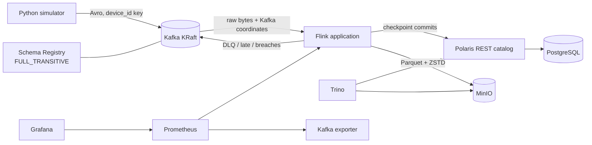
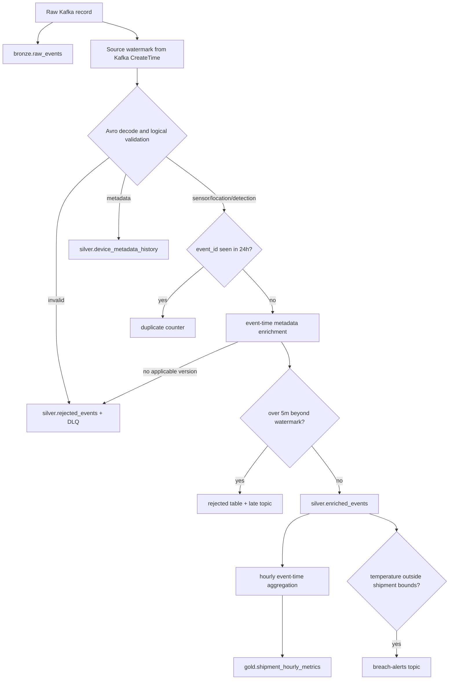

# Architecture and data flow

## Runtime topology

Flink reads all four source topics through one raw source so the first durable representation can
preserve topic, partition, offset, Kafka timestamp, key, schema ID, and exact payload. Decode errors
therefore do not prevent bronze capture. Valid sensor records proceed through keyed deduplication;
metadata is routed to a broadcast-like keyed temporal history and selected by `effective_from <=
event_time` with the greatest matching version. The simulator uses event time as Kafka `CreateTime`,
allowing the source to generate split-aware watermarks with 60 seconds of disorder and 30-second
idle-partition detection even during accelerated replay.

## Processing sequence

## Delivery semantics

- The Kafka source participates in Flink checkpoints and reads committed transactions.
- Iceberg sink commits become visible only after successful checkpoints and are exactly once for
  each individual table.
- Kafka alert/DLQ/late sinks use unique transactional ID prefixes and exactly-once delivery.
- A checkpoint can commit several independent sinks, but those table commits do not form an atomic
  transaction across all bronze, silver, and gold tables. Reconciliation tolerates short-lived
  visibility skew and checks the final converged state.
- `bronze.raw_events` is append-only. Its `(topic, partition, offset)` uniqueness is an acceptance
  invariant rather than an update key.
